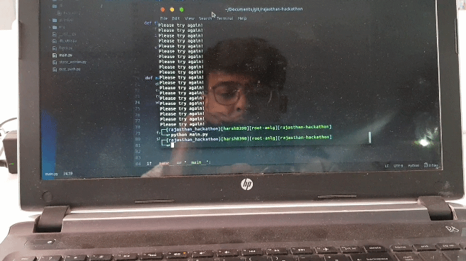

# SmartBell

SmartBell recognizes face of a known person and allows him/her to enter into the room/office.



## Getting Started

These instructions will get you a copy of the project up and running on your local machine for development and testing purposes. See deployment for notes on how to deploy the project on a live system.

### Prerequisites

#### install dlib on macOS/Ubuntu
* [How to install dlib from source on macOS or Ubuntu](https://gist.github.com/ageitgey/629d75c1baac34dfa5ca2a1928a7aeaf)

### Installing

#### first clone the repo
```
git clone https://github.com/Meetmshah/rajasthan-hackathon.git
```
#### change directory to project root
```
cd rajasthan-hackathon
```
#### install dependencies using pip
```
pip install -r requirements.txt
```

## Built With

* [face_recognition](https://github.com/ageitgey/face_recognition) - The python face recognition package
* [Dlib](http://dlib.net/) - toolkit for machine learning algorithms
* [OpenCV](https://opencv.org/) - Computer Vision library
* [FCM](https://firebase.google.com/docs/cloud-messaging/) - Firebase Cloud Messaging
